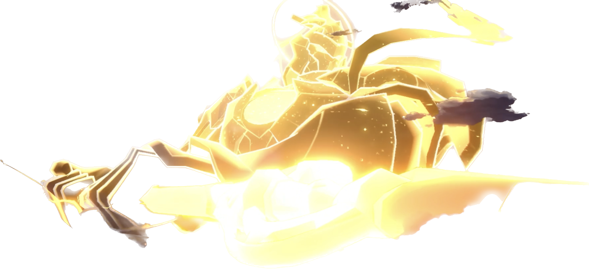
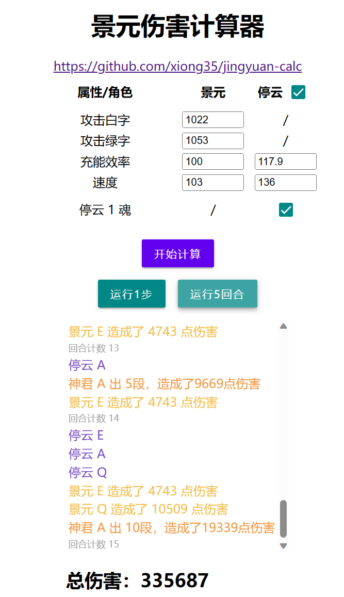
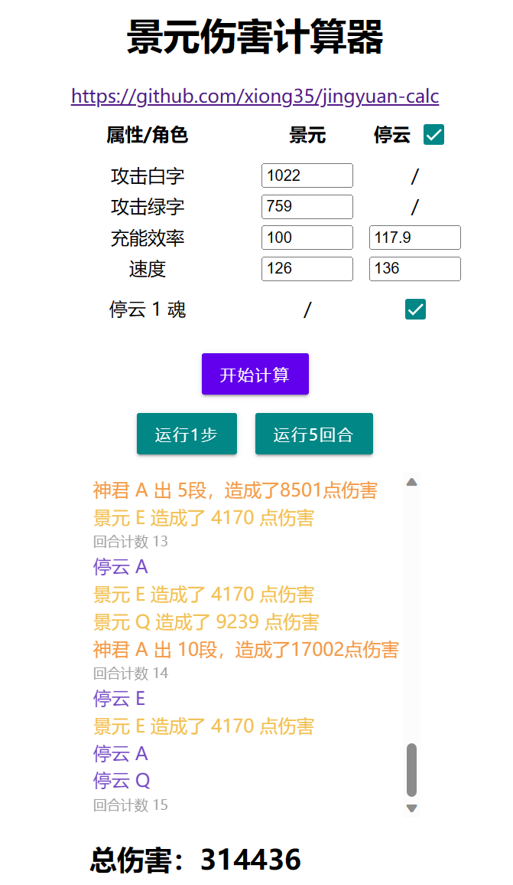

  

# 景元伤害计算器

通过模拟游戏流程来计算特定数值下若干回合内景元攻击的总倍率

使用网址：<http://game.xiong35.cn/jingyuan>

默认数据为我的辣鸡景元数据，请勿喷T^T

## 测试场景

- 敌方有三个怪
- 景元只用E，停云EA交替使用
- 神君的扩散伤害没有被浪费
- 白字为基础数值，是武器攻击力加裸人物的攻击力
- 绿字为加成值，主要为各种途径的百分比加成

可见测试并不是十分严谨，只能得到近似的值，**仅供参考**

## pros

✅ 考虑景元 EQ  
✅ 考虑停云 EQ  
✅ 考虑停云 1 魂效果

## cons

> 大概率不会实现了

❌ 默认能吃满停云 E 的加成  
❌ 仅计算攻击力乘区，没有考虑双爆、增伤等乘区  
❌ 只计算了面对三个敌人的情况  
❌ 停云有 Q 就放了，没有考虑场上情况

## 结论

就我自己目前的数据而言，攻击鞋总收益略大于速度鞋，不过速度快破盾快，这点我自己还是比较喜欢的，就还是用速度鞋好了

左图：攻击鞋15回合  
右图：速度鞋15回合

    
    

